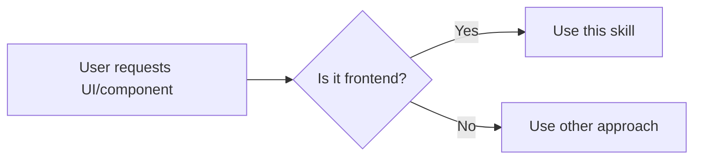

# Frontend Design

## Overview

This skill guides creation of distinctive, production-grade frontend interfaces that avoid generic "AI slop" aesthetics. Implement real working code with exceptional attention to aesthetic details and creative choices.

## When to Use



**Use when:**
- Building web components, pages, or applications
- Creating interfaces with HTML/CSS/JS, React, Vue, or similar
- User wants "polished," "professional," or "high-quality" UI

## Design Thinking

Before coding, understand the context and commit to a BOLD aesthetic direction:
- **Purpose**: What problem does this interface solve? Who uses it?
- **Tone**: Pick an extreme: brutally minimal, maximalist chaos, retro-futuristic, organic/natural, luxury/refined, playful/toy-like, editorial/magazine, brutalist/raw, art deco/geometric, soft/pastel, industrial/utilitarian, etc.
- **Constraints**: Technical requirements (framework, performance, accessibility)
- **Differentiation**: What makes this UNFORGETTABLE?

**CRITICAL**: Choose a clear conceptual direction and execute it with precision. Bold maximalism and refined minimalism both work - the key is intentionality.

## Frontend Aesthetics Guidelines

| Aspect | DO | DON'T |
|--------|-----|-------|
| **Typography** | Distinctive, beautiful fonts (display + body pairings) | Generic fonts (Inter, Roboto, Arial, system fonts) |
| **Color** | Dominant colors with sharp accents, CSS variables | Purple gradients on white, timid even palettes |
| **Motion** | One orchestrated page load, scroll triggers, surprising hovers | Scattered micro-interactions without purpose |
| **Layout** | Asymmetry, overlap, diagonal flow, grid-breaking | Predictable standard layouts |
| **Backgrounds** | Gradient meshes, noise, patterns, depth | Solid colors, no atmosphere |

**Motion focus**: High-impact moments over constant effects. Staggered reveals (animation-delay) create delight.

**NEVER use generic AI aesthetics**:
- Overused font families (Inter, Roboto, Arial, system fonts)
- Cliched color schemes (purple gradients on white)
- Predictable layouts and component patterns
- Cookie-cutter design lacking context-specific character

**Match complexity to vision**: Maximalist designs need elaborate code. Minimalist designs need restraint and precision.

## Implementation

```css
/* Example: CSS variables for cohesive theming */
:root {
  --color-primary: #0a0a0a;
  --color-accent: #ff3d00;
  --font-display: 'Space Grotesk', sans-serif;
  --font-body: 'Source Serif Pro', serif;
}
```

```css
/* Example: Staggered page load animation */
@keyframes fade-in-up {
  from { opacity: 0; transform: translateY(20px); }
  to { opacity: 1; transform: translateY(0); }
}

.hero-section > * {
  animation: fade-in-up 0.6s ease-out forwards;
  opacity: 0;
}

.hero-section > *:nth-child(1) { animation-delay: 0.1s; }
.hero-section > *:nth-child(2) { animation-delay: 0.2s; }
.hero-section > *:nth-child(3) { animation-delay: 0.3s; }
```

## Common Mistakes

| Mistake | Fix |
|---------|-----|
| Converging on "safe" choices (Space Grotesk) | Vary fonts, themes, aesthetics between projects |
| Adding motion everywhere | Focus on 1-2 high-impact moments |
| Evenly distributed colors | Dominant color + sharp accent |
| Solid color backgrounds | Add texture, gradient, or pattern depth |

## Real-World Impact

- Generic AI UI gets dismissed as "slop"
- Distinctive design builds trust and engagement
- One memorable detail > 10 "nice" elements
